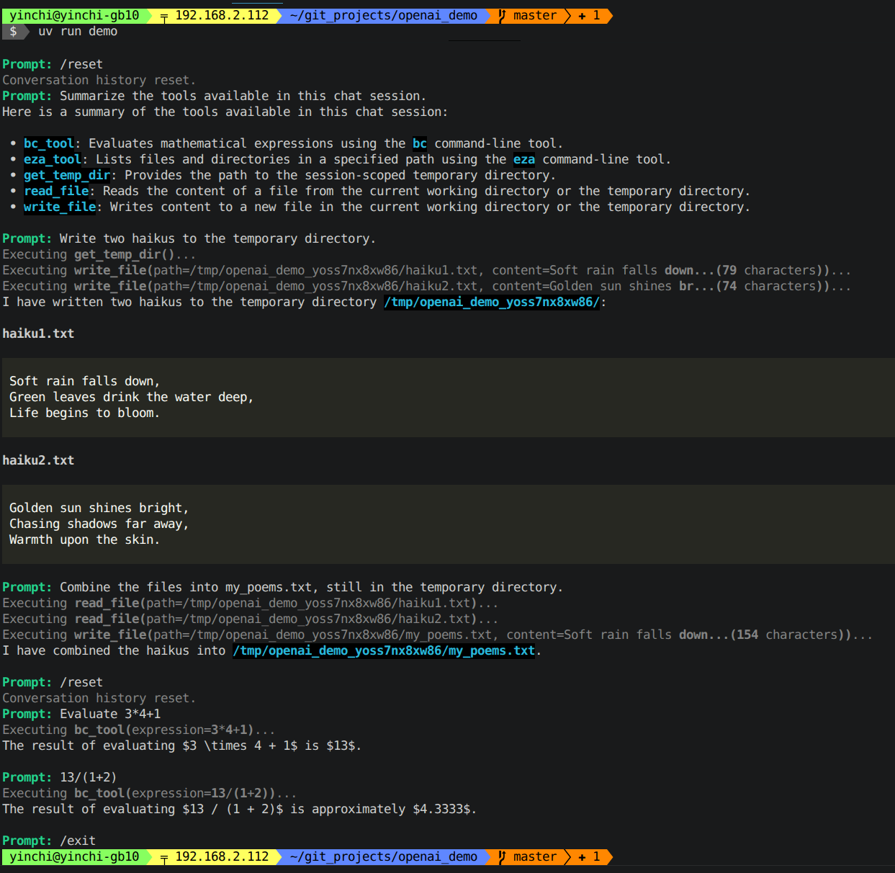

# OpenAI chat program demo

Command-line chat program that demonstrates how to use the OpenAI API for chat completions,
with:

- tool support
- conversation history (with /reset command to reset history)
- Markdown rendering
- web search tool using the Brave Search API



## Setup

### Set up `.env`

```bash
cp .env.example .env
```

Then edit the `.env` file to set up the correct values for the environment variables.
Use shell-style assignments with no spaces around `=`:

```bash
OPENAI_URL=http://localhost:8000/v1
OPENAI_KEY=dummy_key
OPENAI_MODEL=google/gemma-4-26B-A4B-it
HF_TOKEN=hf_...
BRAVE_TOKEN=...
```

Note that the supplied `gemma.sh` script is designed to work with vLLM and the Gemma 4 model, so
the default values in `.env.example` are set accordingly.  However, any OpenAI-compatible API
endpoint and model should work.  For local models, `OPENAI_KEY` can generally be set to any
non-empty value, as authentication is often not required.

### Set up the vLLM server

```bash
uv tool install vllm --torch-backend auto -p 3.13
nohup ./gemma.sh &
```

### Run the demo

```bash
uv run demo
```
